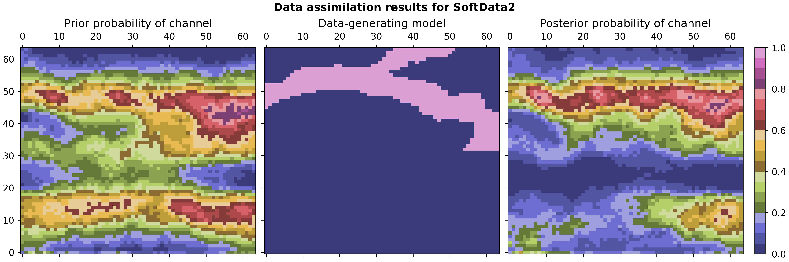

# Ensemble history-matching with SPADE-GAN geomodel

This is the code to reproduce the results of the paper **Ensemble history-matching workflow using interpretable SPADE-GAN geomodel** by Kristian Fossum, Sergey Alyaev, and Ahmed H. Elsheikh, published in First Break 2024.02.

## Cite as:

Kristian Fossum, Alyaev, Sergey, and Ahmed H. Elsheikh. **"Ensemble history-matching workflow using interpretable SPADE-GAN geomodel."** First Break ??, no. 2 (2024): ??-?? https://???.

### Latex

```
@article{alyaev2021probabilistic,
  title={Ensemble history-matching workflow using interpretable SPADE-GAN geomodel},
  author={Fossum, Kristian and Alyaev, Sergey and Elsheikh, Ahmed H},
  journal={First Break},
  volume={??},
  number={2},
  pages={??--??},
  year={2024},
  publisher={European Association of Geoscientists \& Engineers},
  doi={???}
}
```

## Preview of results

The figure below shows data assimilation results for **Soft data - case 2** with the hard-data-constrained prior as the starting point.



## Installation

### Prerequisites
- Ubuntu 20.04
- Python 3.8+ (tested on 3.8.10)

### Pre-configured scripts
The bash script files to install individual components are located in the **Dependences** folder. Alternatively, follow instructions from the library providers below.

### Manual installation
#### 1. OPM-flow
The OPM-flow simulator can be installed by following the instructions at https://opm-project.org/?page_id=245

#### 2. Python-Ensemble-Toolbox (PET)
The PET package can be installed by following the instructions at https://github.com/Python-Ensemble-Toolbox/PET/tree/main

We recommend creating a virtual environment where all needed packages will be installed.  

#### 3. Generation of Nonstationary geological fields using GANs
The GANs package is cloned from the repository https://github.com/ai4netzero/NonstationaryGANs

Note that you need to **pip install torch**in the Python environment used to run the tests.

**GAN.mako** files in sub-directories assume that the **NonstationaryGANs** repository is cloned in the same directory as **spade-gan-inversion**

#### 4. MPSlib
MPSlib package for generating new synthetic true fields can be installed it by following the 
instructions at https://github.com/ergosimulation/mpslib

The **pip** package is available:

```
pip install scikit-mps
```

The MPSlib-produced files to reproduce the publication are included in this repository. 

## Running examples from the First Break paper

To run examples go to a relevant folder and follow the instructions. The example folders are
  0. HardData
  1. SoftData1
  2. SoftData2

The paper includes three numerical examples. The **SoftData** examples rely on the results of the **HardData** example results. Run **HardData** first.


